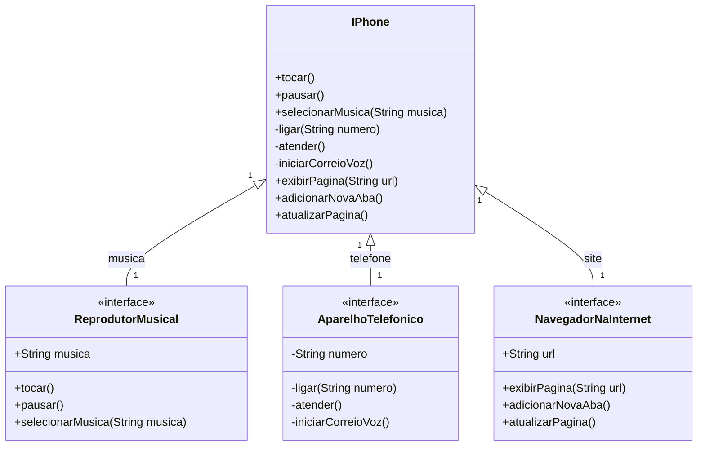

```mermaid
classDiagram
IPhone "1" <|-- "1" Reprodutor Musical : musica
IPhone "1" <|-- "1" Aparelho Telefonico : telefone
IPhone "1" <|-- "1" Navegador Na Internet : site
IPhone :  +tocar()
IPhone : +pausar()
IPhone : +selecionarMusica(String musica)

IPhone: -ligar(String numero)
IPhone: -atender()
IPhone: -iniciarCorreioVoz()

IPhone: +exibirPagina(String url)
IPhone: +adicionarNovaAba()
IPhone: +atualizarPagina()

class Reprodutor Musical{
  <<interface>>
  +String musica
  +tocar()
  +pausar()
  +selecionarMusica(String musica)
  }
class Aparelho Telefonico{
  <<interface>>
  -String numero
  -ligar(String numero)
  -atender()
  -iniciarCorreioVoz()
  }
class Navegador Na Internet{
  <<interface>>
  +String url
  +exibirPagina(String url)
  +adicionarNovaAba()
  +atualizarPagina()
  }
```